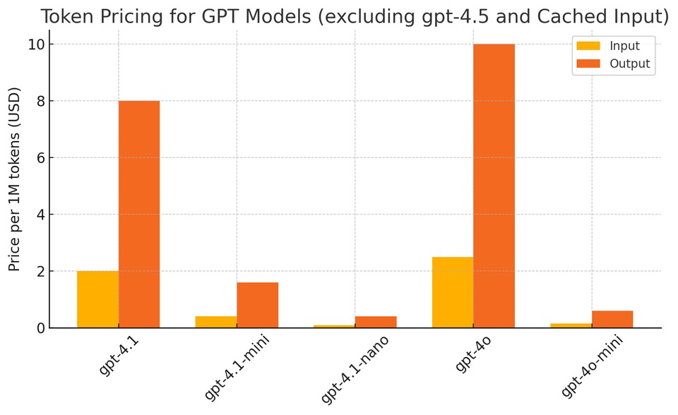

# 🧠 OpenAI API 가격표 (Last Updated: 2025/04/17)

🔗 [OpenAI API Pricing](https://openai.com/api/pricing/)
🔗 [OpenAI API Pricing (docs)](https://platform.openai.com/docs/pricing)

## 🔍 Reasoning Models

### ◾️ `o1`
- **지식 기준일:** 2023-10-01  
- **가격:**
  - 📥 Input: **$15.00** / 1M tokens
  - 📥 Cached Input: **$7.50** / 1M tokens
  - 📤 Output: **$60.00** / 1M tokens
- **버전:**
  - `o1-preview-2024-09-12`: 128K context / 32,768 output tokens  
  - `o1-2024-12-17`: 200K context / 100K output tokens  

---

### ◾️ `o3`
- **지식 기준일:** 2024-06-01
- **가격:**
  - 📥 Input: **$10.00** / 1M tokens
  - 📥 Cached Input: **$2.50** / 1M tokens
  - 📤 Output: **$40.00** / 1M tokens
- **버전:**
  - `o3-2025-04-16`: 200K context / 100K output tokens
---

### ◾️ `o1-mini`
> ⚠️ `o1-mini` 대신 `o3-mini` 사용 권장
- **지식 기준일:** 2023-10-01  
- **가격:**
  - 📥 Input: **$1.10** / 1M tokens
  - 📥 Cached Input: **$0.55** / 1M tokens
  - 📤 Output: **$4.40** / 1M tokens
- **버전:**
  - `o1-mini-2024-09-12`: 128K context / 65,536 output tokens

---

### ◾️ `o3-mini`
- **지식 기준일:** 2023-10-01  
- **가격:**
  - 📥 Input: **$1.10** / 1M tokens  
  - 📥 Cached Input: **$0.55** / 1M tokens  
  - 📤 Output: **$4.40** / 1M tokens
- **버전:**
  - `o3-mini-2025-01-31`: 200K context / 100K output tokens

---

### ◾️ `o4-mini`
- **지식 기준일:** 2024-06-01
- **가격:**
  - 📥 Input: **$1.10** / 1M tokens  
  - 📥 Cached Input: **$0.275** / 1M tokens  
  - 📤 Output: **$4.40** / 1M tokens
- **버전:**
  - `o4-mini-2025-04-16`: 200K context / 100K output tokens

---

## 💬 Chat Models

### ◾️ `GPT-4.1`
- **지식 기준일:** 2024-06-01  
- **가격:**
  - 📥 Input: **$2.00** / 1M tokens
  - 📥 Cached Input: **$0.50** / 1M tokens
  - 📤 Output: **$8.00** / 1M tokens
- **버전:**
  - `gpt-4.1-2025-04-14`: 1M context / 32,768 output tokens

---

### ◾️ `GPT-4.1 mini`
- **지식 기준일:** 2024-06-01  
- **가격:**
  - 📥 Input: **$0.40** / 1M tokens
  - 📥 Cached Input: **$0.10** / 1M tokens
  - 📤 Output: **$1.60** / 1M tokens
- **버전:** 
  - `gpt-4.1-mini-2025-04-14`: 1M context / 32,768 output tokens 

---

### ◾️ `GPT-4.1 nano`
- **지식 기준일:** 2024-06-01  
- **가격:**
  - 📥 Input: **$0.10** / 1M tokens
  - 📥 Cached Input: **$0.025** / 1M tokens
  - 📤 Output: **$0.40** / 1M tokens
- **버전:**
  - `gpt-4.1-nano-2025-04-14`: 1M context / 32,768 output tokens 

---

### ◾️ `GPT-4o`
- **지식 기준일:** 2023-10-01  
- **버전:**  
  - `gpt-4o-2024-11-20`, `gpt-4o-2024-08-06`: 128K context / 16,384 output tokens
    - creative writing ability 가 향상되었다고 하는데, 이모지가 좀 더 늘어난 것 같다.
  - `gpt-4o-2024-05-13`: 128K context / 4,096 output tokens
- **가격:**
  - `2024-11-20` & `2024-08-06`:
    - 📥 Input: **$2.50** / 1M tokens
    - 📥 Cached Input: **$1.25** / 1M tokens
    - 📤 Output: **$10.00** / 1M tokens
  - `2024-05-13`:
    - 📥 Input: **$5.00** / 1M tokens
    - 📤 Output: **$15.00** / 1M tokens

---

### ◾️ `GPT-4o mini`
- **지식 기준일:** 2023-10-01  
- **가격:**
  - 📥 Input: **$0.15** / 1M tokens
  - 📥 Cached Input: **$0.075** / 1M tokens
  - 📤 Output: **$0.60** / 1M tokens
- **버전:**
  - `gpt-4o-mini-2024-07-18`: 128K context / 16,384 output tokens

---

## 🔎 Embedding Models

| 모델명 | 가격 (1M tokens 기준) |
|--------|------------------------|
| `text-embedding-3-small` | **$0.02** |
| `text-embedding-3-large` | **$0.13** |